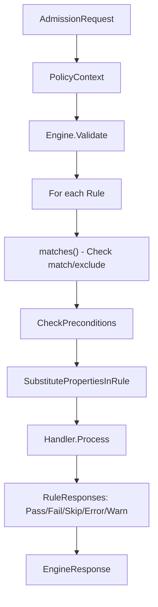
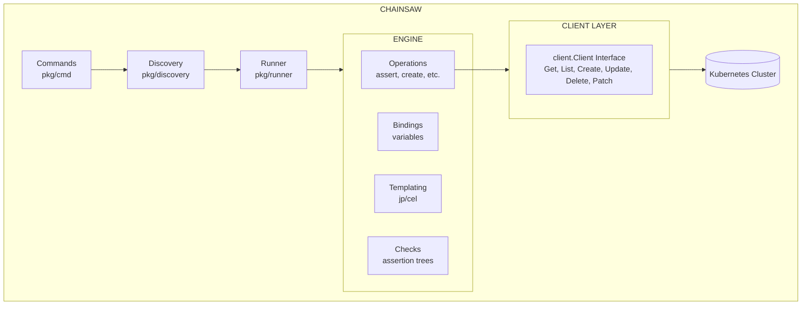
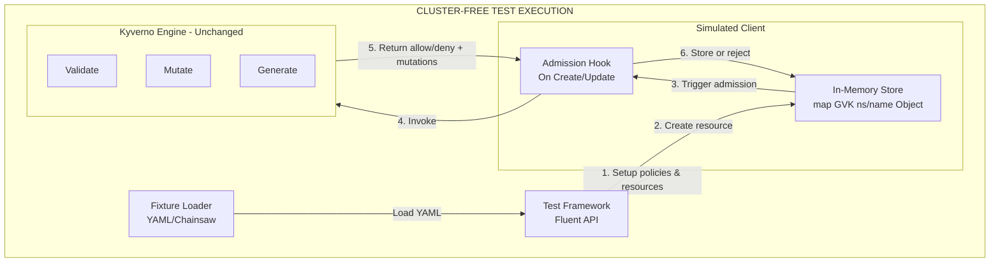
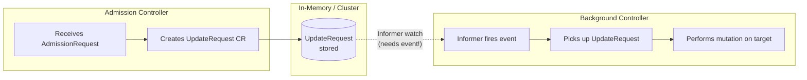

# Kyverno Integration Testing Framework - Research & Proposal


## 1. Problem Statement

### Why Chainsaw Tests Are Slow ?

Chainsaw tests execute against a **real Kubernetes cluster**, which involves:

| Operation | What Happens | Typical Time |
|-----------|--------------|--------------|
| **Namespace creation** | API call + wait for Ready | 1-2s |
| **Policy creation** | API call + webhook registration + Ready status | 3-5s |
| **Resource creation** | API call + admission webhook processing | 1-2s |
| **Assertions (polling)** | Repeated API calls until condition met | 1-30s |
| **Cleanup** | Delete resources + wait for finalizers | 2-5s |

**Total per test: 10-45+ seconds**

> [!NOTE]
> Additionally, **47% of Chainsaw tests use `sleep` statements** (462 out of 969 tests), indicating reliance on async controller behavior.

### What Tests Are Actually Testing ?

Analysis of the 969 Chainsaw tests by category:

| Category | Count | Actually Needs Cluster? |
|----------|-------|------------------------|
| **Policy validation logic** (CEL/pattern matching) | ~250 | No - pure computation |
| **Autogen rule generation** | 17 | No - deterministic transformation |
| **Admission accept/reject** | ~200 | Partial - can simulate admission flow |
| **Mutation logic** | ~100 | Partial - can test mutation, not persistence |
| **Controller reconciliation** (generate, sync, reports) | ~250 | Yes - needs controller loops |
| **Webhook registration/management** | ~50 | Yes - tests Kyverno controllers |
| **Image verification** | 47 | Yes - needs registry access |
| **Other (cleanup, TTL, events)** | ~100 | Yes - needs controllers |

> [!IMPORTANT]
> **Key Insight:** Approximately **30-40% of tests** (290-390 tests) are fundamentally testing **policy evaluation logic** that doesn't inherently require a cluster.


## 2. Kyverno Engine Architecture Analysis

### Policy Evaluation Flow (No Cluster Needed)

The policy engine (`pkg/engine/`) follows a clean evaluation flow:



### Engine Dependencies (Dependency Injection Design)

The engine is designed with **dependency injection**. External dependencies can be set to `nil`:

```go
// From pkg/engine/validation_test.go - ALREADY tests without a cluster!
e := NewEngine(
    cfg,                  // Configuration
    jp,                   // JMESPath evaluator
    nil,                  // ← nil client disables API calls
    registryClientFactory,
    imageverifycache.DisabledImageVerifyCache(),
    contextLoader,
    nil,                  // ← nil exception selector
    nil,                  // ← nil metrics
)
```

### Engine Struct Dependencies

```go
type engine struct {
    configuration     config.Configuration           // Global configuration
    jp                jmespath.Interface             // JMESPath evaluator
    client            engineapi.Client               // K8s API client (can be nil)
    rclientFactory    engineapi.RegistryClientFactory // Container registry access
    ivCache           imageverifycache.Client        // Image verification caching
    contextLoader     engineapi.ContextLoaderFactory // Context entry loader
    exceptionSelector engineapi.PolicyExceptionSelector // Policy exceptions
    metrics           metrics.PolicyEngineMetrics    // Observability
}
```

### Existing Mock/Fake Infrastructure

Kyverno already has extensive mocking infrastructure:

| Component | Location | Purpose |
|-----------|----------|---------|
| `dclient.NewFakeClient()` | `pkg/clients/dclient/fake.go` | Fake K8s dynamic client |
| `NewFakeDiscoveryClient()` | `pkg/clients/dclient/fake.go` | GVR/GVK mapping |
| `MockContext` | `pkg/engine/context/mock_context.go` | Context variable validation |
| `NewFakeHandlers()` | `pkg/webhooks/resource/fake.go` | Complete webhook handler setup |
| `cosign.SetMock()` | `pkg/cosign/mock.go` | Image signature verification |
| CEL library mocks | `pkg/cel/libs/*/mock.go` | Resource, image, globalcontext |

### Current Unit Test Pattern (Gap Identified)

Current unit tests embed policies as raw JSON - verbose and hard to maintain:

```go
// Current pattern in pkg/engine/validation_test.go
rawPolicy := []byte(`{
    "apiVersion": "kyverno.io/v1",
    "kind": "ClusterPolicy",
    "metadata": {"name": "validate-image"},
    "spec": {"rules": [...]}
}`)

var policy kyvernov1.ClusterPolicy
json.Unmarshal(rawPolicy, &policy)
```

> [!TIP]
> **Opportunity:** Load from YAML files like Chainsaw does, reusing existing test data.

---

## 3. Chainsaw Architecture Analysis

### Chainsaw High-Level Architecture



### Reusable Chainsaw Components (No Modification Needed)

| Package | Purpose | Reusability |
|---------|---------|-------------|
| `pkg/loaders/` | Parse YAML test files | 100% reusable |
| `pkg/apis/v1alpha1/` | Test/Step/Operation types | 100% reusable |
| `pkg/engine/checks/` | Assertion tree evaluation | 100% reusable |
| `pkg/engine/templating/` | JMESPath/CEL expressions | 100% reusable |
| `pkg/engine/bindings/` | Variable management | 100% reusable |
| `pkg/expressions/` | Expression evaluation | 100% reusable |

### Chainsaw's FakeClient Pattern

Chainsaw already demonstrates cluster-free assertions:

```go
// From chainsaw/pkg/client/testing/fake_client.go
type FakeClient struct {
    GetFn    func(ctx context.Context, call int, key ObjectKey, obj Object, ...) error
    CreateFn func(ctx context.Context, call int, obj Object, ...) error
    ListFn   func(ctx context.Context, call int, list ObjectList, ...) error
    // ... other operations
}

// Used in chainsaw assert command - PROVES cluster-free assertions work!
client = &tclient.FakeClient{
    GetFn: func(ctx context.Context, _ int, _ ctrlclient.ObjectKey, obj ctrlclient.Object, ...) error {
        *obj.(*unstructured.Unstructured) = ressources[0]  // Return pre-loaded resource
        return nil
    },
}
```

### Why Chainsaw Needs a Cluster (Interception Points) ?

Every mutating operation goes through the client:

```go
// pkg/engine/operations/create/operation.go
err := o.client.Create(ctx, &obj)  // ← We intercept here

// pkg/engine/operations/assert/operation.go  
candidates, err := internal.Read(ctx, &obj, o.client)  // ← We intercept here
```

> [!TIP]
> **Solution:** Replace the client with a **simulated client** that:
> 1. Stores resources in memory
> 2. **Invokes Kyverno policy engine** on Create/Update (simulating admission)
> 3. Returns resources from memory for assertions


## 4. Proposed Architecture

### Core Concept: Policy Engine as Admission Interceptor



### Proposed Directory Structure

```sh
pkg/
    └── testing/                    # NEW: Integration test framework
        ├── framework/              # Core framework utilities
        │   ├── framework.go        # Main test harness
        │   ├── options.go          # Configuration options
        │   └── assertions.go       # Custom assertions
        ├── fixtures/               # Test fixture loading
        │   ├── loader.go           # YAML/JSON resource loader
        │   └── chainsaw.go         # Chainsaw test data adapter
        ├── fake/                   # Consolidated fake implementations
        │   ├── client.go           # Enhanced fake K8s client
        │   ├── discovery.go        # Fake discovery client
        │   └── informers.go        # Fake informer factories
        └── engine/                 # Engine test helpers
            ├── policy.go           # Policy testing utilities
            └── context.go          # Context builders
```

<!-- 
## 5. Detailed Component Design

### 5.1 Test Framework Core (`pkg/testing/framework/`)

#### `framework.go` - Main Test Harness

```go
type Framework struct {
    t            *testing.T
    client       dclient.Interface          // Fake K8s client
    engine       engine.Engine              // Policy engine
    policyCache  policycache.Cache          // Cached policies
    contextLoader enginecontext.Loader      // Context for policy evaluation
    resources    []unstructured.Unstructured // Resources to test against
    policies     []kyvernov1.PolicyInterface // Policies to apply
}

// Constructor
func New(t *testing.T, opts ...Option) *Framework

// Add test data
func (f *Framework) WithPolicy(policy kyvernov1.PolicyInterface) *Framework
func (f *Framework) WithPolicyFromFile(path string) *Framework
func (f *Framework) WithResource(resource unstructured.Unstructured) *Framework
func (f *Framework) WithResourceFromFile(path string) *Framework
func (f *Framework) WithExistingResource(resource unstructured.Unstructured) *Framework

// Execute policy operations
func (f *Framework) Validate() *ValidationResult
func (f *Framework) Mutate() *MutationResult  
func (f *Framework) Generate() *GenerationResult
```

**Example Usage:**

```go
func TestValidationPolicy(t *testing.T) {
    f := framework.New(t).
        WithPolicyFromFile("testdata/policies/require-labels.yaml").
        WithResourceFromFile("testdata/resources/pod-no-labels.yaml")
    
    result := f.Validate()
    
    result.AssertBlocked()
    result.AssertMessageContains("label 'app' is required")
}
```

#### `options.go` - Configuration Options

```go
type Option func(*Framework)

func WithNamespace(ns string) Option
func WithClusterResources(resources ...runtime.Object) Option
func WithGlobalContext(gc *kyvernov2.GlobalContextEntry) Option
func WithFeatureFlags(flags ...string) Option
func WithMetrics(enabled bool) Option
func WithLogger(logger logr.Logger) Option
```

#### `assertions.go` - Custom Assertions

```go
// Validation result assertions
type ValidationResult struct {
    response *engine.EngineResponse
    t        *testing.T
}

func (r *ValidationResult) AssertAllowed()
func (r *ValidationResult) AssertBlocked()
func (r *ValidationResult) AssertRuleStatus(rule string, status RuleStatus)
func (r *ValidationResult) AssertMessageContains(substring string)
func (r *ValidationResult) AssertWarning()

// Mutation result assertions
type MutationResult struct {
    response *engine.EngineResponse
    patched  unstructured.Unstructured
    t        *testing.T
}

func (r *MutationResult) AssertMutated()
func (r *MutationResult) AssertNotMutated()
func (r *MutationResult) AssertPatchedResource() unstructured.Unstructured
func (r *MutationResult) AssertFieldEquals(jsonPath string, expected interface{})
func (r *MutationResult) AssertFieldAdded(jsonPath string)

// Generation result assertions
type GenerationResult struct {
    response   *engine.EngineResponse
    generated  []unstructured.Unstructured
    t          *testing.T
}

func (r *GenerationResult) AssertGenerated(count int)
func (r *GenerationResult) AssertGeneratedKind(kind string)
func (r *GenerationResult) GetGenerated() []unstructured.Unstructured
```

### 5.2 Fixture Loader (`pkg/testing/fixtures/`)

#### `loader.go` - YAML/JSON Resource Loader

```go
// Load a single policy
func LoadPolicy(path string) (kyvernov1.PolicyInterface, error)
func MustLoadPolicy(t *testing.T, path string) kyvernov1.PolicyInterface

// Load a single resource
func LoadResource(path string) (unstructured.Unstructured, error)
func MustLoadResource(t *testing.T, path string) unstructured.Unstructured

// Load multiple resources from a file (multi-doc YAML)
func LoadResources(path string) ([]unstructured.Unstructured, error)

// Load all YAML files from a directory
func LoadDirectory(path string) (*TestData, error)

type TestData struct {
    Policies  []kyvernov1.PolicyInterface
    Resources []unstructured.Unstructured
}
```

#### `chainsaw.go` - Chainsaw Test Data Adapter

```go
// Load from a Chainsaw test directory
func FromChainsaw(testDir string) (*ChainsawTestCase, error)

type ChainsawTestCase struct {
    Name      string
    Policies  []kyvernov1.PolicyInterface
    Resources []unstructured.Unstructured
    Expected  *ExpectedOutcome
}

// Example: Reuse existing Chainsaw test data
func TestFromChainsaw(t *testing.T) {
    tc, err := fixtures.FromChainsaw("test/conformance/chainsaw/validating-policies/check-label-app")
    require.NoError(t, err)
    
    f := framework.New(t).
        WithPolicies(tc.Policies...).
        WithResources(tc.Resources...)
    
    result := f.Validate()
    // Assert based on tc.Expected
}
```

### 5.3 Enhanced Fake Client (`pkg/testing/fake/`)

#### `client.go` - Enhanced Fake K8s Client

```go
type FakeClient struct {
    dclient.Interface
    tracker testing.ObjectTracker
}

// Create with pre-populated resources
func NewClient(objects ...runtime.Object) *FakeClient

// Add resources after creation
func (c *FakeClient) AddResource(obj runtime.Object)
func (c *FakeClient) AddResources(objs ...runtime.Object)

// Simulate failures
func (c *FakeClient) FailOnGet(gvr schema.GroupVersionResource, err error)
func (c *FakeClient) FailOnCreate(gvr schema.GroupVersionResource, err error)

// Track what happened
func (c *FakeClient) GetCreatedResources() []runtime.Object
func (c *FakeClient) GetUpdatedResources() []runtime.Object
func (c *FakeClient) GetDeletedResources() []ObjectKey
```

### 5.4 Engine Test Helpers (`pkg/testing/engine/`)

#### `policy.go` - Policy Testing Utilities

```go
type PolicyBuilder struct {
    policy *kyvernov1.ClusterPolicy
}

func NewPolicyBuilder(name string) *PolicyBuilder
func (b *PolicyBuilder) WithValidationRule(rule ValidationRuleConfig) *PolicyBuilder
func (b *PolicyBuilder) WithMutationRule(rule MutationRuleConfig) *PolicyBuilder
func (b *PolicyBuilder) WithGenerateRule(rule GenerateRuleConfig) *PolicyBuilder
func (b *PolicyBuilder) Build() *kyvernov1.ClusterPolicy

// Common validation patterns
func RequireLabelPolicy(labelKey string) *kyvernov1.ClusterPolicy
func DenyPrivilegedPolicy() *kyvernov1.ClusterPolicy
```

#### `context.go` - Context Builders

```go
type ContextBuilder struct {
    ctx enginecontext.Interface
}

func NewContextBuilder() *ContextBuilder
func (b *ContextBuilder) WithNamespace(ns string) *ContextBuilder
func (b *ContextBuilder) WithServiceAccount(name string) *ContextBuilder
func (b *ContextBuilder) WithUserInfo(user authenticationv1.UserInfo) *ContextBuilder
func (b *ContextBuilder) WithVariable(name string, value interface{}) *ContextBuilder
func (b *ContextBuilder) WithAPIResource(gvr schema.GroupVersionResource, obj runtime.Object) *ContextBuilder
func (b *ContextBuilder) Build() enginecontext.Interface
``` -->

## 5. Chainsaw Tests Conversion Analysis

### High Priority - Pure Logic Tests (Immediately Convertible)

| Test Directory | What It Tests | Why Convertible |
|----------------|---------------|-----------------|
| `validating-policies/validation-rules/reject` | CEL expression rejects deployment | Pure evaluation logic |
| `validating-policies/validation-rules/accept` | CEL expression accepts deployment | Pure evaluation logic |
| `validating-policies/autogen/*` | Autogen rule generation | Deterministic transformation |
| `mutating-policies/admission/*` | Mutation patches | Pure mutation logic |
| `policy-validation/*` | Policy schema validation | Validation logic only |
| `generate-validating-admission-policy/skip-generate/*` | VAP generation conditions | Transform logic |

**Example Chainsaw Test (Current):**

```yaml
# test/conformance/chainsaw/validating-policies/validation-rules/reject/chainsaw-test.yaml
apiVersion: chainsaw.kyverno.io/v1alpha1
kind: Test
metadata:
  name: reject
spec:
  steps:
  - name: create policy
    use:
      template: ../../../_step-templates/create-policy.yaml
  - name: wait-validating-policy-ready
    use:
      template: ../../../_step-templates/validating-policy-ready.yaml
  - name: create deployment
    try:
    - create:
        file: deployment.yaml
        expect:
          - check:
              ($error != null): true  # Expect rejection
```

**Converted Integration Test:**

```go
func TestValidationPolicy_RejectDeploymentWithoutLabels(t *testing.T) {
    // Load from same YAML files!
    policy := fixtures.MustLoadPolicy(t, 
        "test/conformance/chainsaw/validating-policies/validation-rules/reject/policy.yaml")
    deployment := fixtures.MustLoadResource(t, 
        "test/conformance/chainsaw/validating-policies/validation-rules/reject/deployment.yaml")
    
    f := framework.New(t).WithPolicy(policy)
    
    result := f.Create(deployment)
    
    result.AssertRejected()
    result.AssertMessageContains("env=prod")
}
// Execution Time: <10ms (vs 10-45s with real cluster)
```

### Medium Priority - Admission Simulation

| Test Directory | What It Tests | Adaptation Needed |
|----------------|---------------|-------------------|
| `validating-policies/exceptions/*` | PolicyException matching | Mock exception selector |
| `validating-policies/context/configmap` | ConfigMap context lookup | Mock ConfigMap resolver |
| `mutating-policies/foreach/*` | ForEach mutations | Multiple mutations |

### Low Priority - Need Controllers (Keep in Chainsaw)

| Test Directory | Why Not Convertible |
|----------------|---------------------|
| `generating-policies/clone/sync/*` | Requires reconciliation loop |
| `reports/*` | Requires background controller |
| `webhook-configurations/*` | Tests controller behavior |
| `globalcontext/*` | May need external API calls |


## 6. Implementation Phases

### Phase 1: Core Framework (Week 1-2)

| Task | Description |
|------|-------------|
| Create `pkg/testing/framework/` | Base test harness with fluent API |
| Create `pkg/testing/fixtures/` | YAML loader for policies and resources |
| Create `pkg/testing/fake/` | Consolidate and enhance fake clients |
| Basic validation test | Prove the concept with 3-5 simple tests |
| Benchmark | Target <100ms per test |

### Phase 2: Expand Coverage (Week 3-4)

| Task | Description |
|------|-------------|
| Simulated admission client | In-memory resource store with policy engine invocation |
| Validation policy tests | Port 10-15 Chainsaw validation tests |
| Mutation policy tests | Port 10-15 Chainsaw mutation tests |
| Autogen tests | Port autogen verification tests |
| CEL expression tests | Test CEL library functions |

### Phase 3: Advanced Features (Week 5-6)

| Task | Description |
|------|-------------|
| Exception handling | PolicyException matching in integration tests |
| Context entries | Mock ConfigMap, APICall context loaders |
| Generation policy tests | Port generation logic tests |
| Error scenario tests | Test failure modes and edge cases |

### Phase 4: Documentation & CI (Week 7-8)

| Task | Description |
|------|-------------|
| Developer documentation | How to write integration tests |
| Makefile targets | `make test-integration` |
| CI integration | Add to GitHub Actions workflow |
| Migration guide | How to port Chainsaw tests |
| Contribution guidelines | Best practices for new tests |


## 7. Technical Decisions

### 1. No Real Cluster Required
- Use `k8s.io/client-go/fake` for Kubernetes API simulation
- Use existing fakes in `pkg/clients/dclient/fake.go`
- Avoid `envtest` to keep tests fast (<1s per test)

### 2. Leverage Existing Code
The codebase already has excellent building blocks:
- `dclient.NewFakeClient()` - Fake dynamic client
- `NewFakeHandlers()` in `pkg/webhooks/resource/fake.go`
- `MockContext` in `pkg/engine/context/mock_context.go`
- `FakeContextProvider` in `pkg/cel/libs/fake_context.go`

### 3. Chainsaw Test Data Reuse
- Create adapter to load resources from `test/conformance/chainsaw/`
- Allows gradual migration of simple Chainsaw tests
- Maintains single source of truth for test fixtures

### 4. Testing Library
- Use `github.com/stretchr/testify` (already in use)
- Standard Go `testing` package
- No additional dependencies needed


## 8. Technical Challenges & Solutions

### Challenge 1: RESTMapper Dependency

> [!WARNING]
> **Problem:** Many operations need `RESTMapper` to convert GVK↔GVR

**Solution:** Kyverno's `fakeDiscoveryClient` already handles this:

```go
// Already exists in pkg/clients/dclient/fake.go
func NewFakeDiscoveryClient(registeredResources []schema.GroupVersionResource) *fakeDiscoveryClient {
    res := []schema.GroupVersionResource{
        {Version: "v1", Resource: "configmaps"},
        {Version: "v1", Resource: "namespaces"},
        {Group: "apps", Version: "v1", Resource: "deployments"},
        // ... pre-registered common resources
    }
}
```

### Challenge 2: Namespace-Scoped vs Cluster-Scoped

> [!WARNING]
> **Problem:** Need to know if resources are namespaced

**Solution:** Extend fake discovery client or use `IsObjectNamespaced()` with a static map.

### Challenge 3: Context Entries (APICall, ConfigMap)

> [!WARNING]
> **Problem:** Some policies use `context.apiCall` or `context.configMap`

**Solution:** 
- For tests that need these: mock the `ContextLoaderFactory` with pre-defined responses
- For tests that don't: leave as `nil` (already supported)


## 9. Success Metrics

| Metric | Current (Chainsaw) | Target (Integration) |
|--------|-------------------|----------------------|
| **Time per test** | 10-45s | <100ms |
| **CI pipeline time** | 30-60 min | <5 min (for convertible tests) |
| **Local iteration** | Need cluster | `go test ./...` |
| **Test coverage** | 969 e2e tests | Convert 200-300 to integration |


## 10. Benefits

1. **Faster Development Cycle**: Developers can run tests locally without minikube/kind
2. **Faster CI**: 10-100x speedup for policy logic tests
3. **Better Test Isolation**: No flaky network/cluster issues
4. **Easier Debugging**: Step through Go code vs. kubectl debugging
5. **Lower Barrier**: Contributors can test without K8s knowledge


## 11. Open Challenge: Controller Informers

> [!IMPORTANT]
> **Maintainer Feedback:** The key architectural challenge is how informers on Kyverno controllers will fire events when testing without a real API server.

### The Problem

Our initial proposal focuses on **admission-time testing** (validate/mutate at webhook). However, Kyverno has **background controllers** that:

1. Watch for resources via **informers** (event-driven)
2. React to add/update/delete events
3. Perform async operations (background mutations, policy reports, cleanup)

### Example: UpdateRequest Workflow



**The challenge:** If we use a fake client that tests see, but Kyverno controllers expect informer events to fire, **how do informers get notified when there's no API server?**

### Two Testing Scopes

| Scope | What We Test | Informers Needed? |
|-------|--------------|-------------------|
| **Engine-level** | Policy evaluation logic (CEL, patterns, mutations) | No |
| **Controller-level** | Multi-controller workflows (admission → background → reports) | Yes |

### Potential Solutions

#### Option 1: Fake Informers with Event Injection

The `k8s.io/client-go` library supports fake informers that can be manually fed events:

```go
// Conceptual approach
fakeClient := fake.NewSimpleDynamicClient(scheme, objects...)
informerFactory := dynamicinformer.NewDynamicSharedInformerFactory(fakeClient, 0)

// When a resource is created, manually inject the event
informer.GetStore().Add(obj)  // Triggers handlers
```

**Challenge:** Standard fake clients don't automatically trigger informer events. We'd need to:
- Wrap the fake client to intercept Create/Update/Delete
- Manually inject events into the informer's store
- Or use controller-runtime's fake cache if Kyverno uses it

#### Option 2: Event-Driven Test Harness

Build a test harness that runs real controllers with fake I/O:

```go
harness := NewTestHarness(t)
harness.CreatePolicy(policy)
harness.CreateResource(deployment)

// Wait for background controller to process
harness.WaitForCondition(func() bool {
    ur := harness.GetUpdateRequest("ur-name")
    return ur.Status.State == "Completed"
}, 5*time.Second)

harness.AssertResourceHasLabel(deployment, "mutated", "true")
```

#### Option 3: Tick-Based Execution Model

Instead of real waits, manually advance the reconcile loop:

```go
harness.CreateResource(deployment)
harness.Tick()  // Process one reconcile cycle
harness.Tick()  // Process another
harness.AssertState(...)
```

**Benefit:** Deterministic, faster tests
**Challenge:** More complex to implement

### Open Questions

1. **Controller architecture:** Does Kyverno use:
   - Standard `client-go` SharedInformers?
   - Controller-runtime's `cache.Cache`?
   - Custom informer setup?

2. **Which controllers are highest priority for testing?**
   - Background mutation controller?
   - Report controller?
   - Cleanup controller?

3. **Execution model preference:**
   - Real goroutines with short waits (simpler, slightly slower)?
   - Deterministic tick-through model (faster, more complex)?

4. **Acceptable test time for controller tests:**
   - <100ms (like engine tests)?
   - <1 second (acceptable for multi-controller flows)?

### Next Steps for Research

- [ ] Trace how `UpdateRequest` informer is set up in Kyverno controllers
- [ ] Identify if controller-runtime patterns are used
- [ ] Prototype a minimal fake informer that triggers one controller
- [ ] Document which controller workflows are highest priority to test


<!-- 
## 12. Complete Example Test

```go
package integration_test

import (
    "testing"
    
    "github.com/kyverno/kyverno/pkg/testing/framework"
    "github.com/kyverno/kyverno/pkg/testing/fixtures"
)

func TestValidationPolicy_RequireLabels(t *testing.T) {
    // Load test data from files
    policy := fixtures.MustLoadPolicy(t, "testdata/require-labels.yaml")
    podWithoutLabels := fixtures.MustLoadResource(t, "testdata/pod-no-labels.yaml")
    podWithLabels := fixtures.MustLoadResource(t, "testdata/pod-with-labels.yaml")
    
    t.Run("blocks pod without required labels", func(t *testing.T) {
        f := framework.New(t).
            WithPolicy(policy).
            WithResource(podWithoutLabels)
        
        result := f.Validate()
        
        result.AssertBlocked()
        result.AssertMessageContains("label 'app' is required")
    })
    
    t.Run("allows pod with required labels", func(t *testing.T) {
        f := framework.New(t).
            WithPolicy(policy).
            WithResource(podWithLabels)
        
        result := f.Validate()
        
        result.AssertAllowed()
    })
}

func TestMutationPolicy_AddDefaultLabels(t *testing.T) {
    f := framework.New(t).
        WithPolicyFromFile("testdata/add-default-labels.yaml").
        WithResourceFromFile("testdata/pod-minimal.yaml")
    
    result := f.Mutate()
    
    result.AssertMutated()
    result.AssertFieldEquals("metadata.labels.managed-by", "kyverno")
    result.AssertFieldEquals("metadata.labels.environment", "default")
}

func TestGenerationPolicy_CreateNetworkPolicy(t *testing.T) {
    f := framework.New(t).
        WithPolicyFromFile("testdata/generate-networkpolicy.yaml").
        WithResourceFromFile("testdata/namespace.yaml")
    
    result := f.Generate()
    
    result.AssertGenerated(1)
    result.AssertGeneratedKind("NetworkPolicy")
    
    networkPolicy := result.GetGenerated()[0]
    assert.Equal(t, "default-deny", networkPolicy.GetName())
}

// Reuse Chainsaw test data directly
func TestFromChainsawTestData(t *testing.T) {
    tc, err := fixtures.FromChainsaw(
        "test/conformance/chainsaw/validating-policies/validation-rules/reject")
    require.NoError(t, err)
    
    f := framework.New(t).
        WithPolicies(tc.Policies...).
        WithResources(tc.Resources...)
    
    result := f.Validate()
    result.AssertBlocked()
}
``` -->
